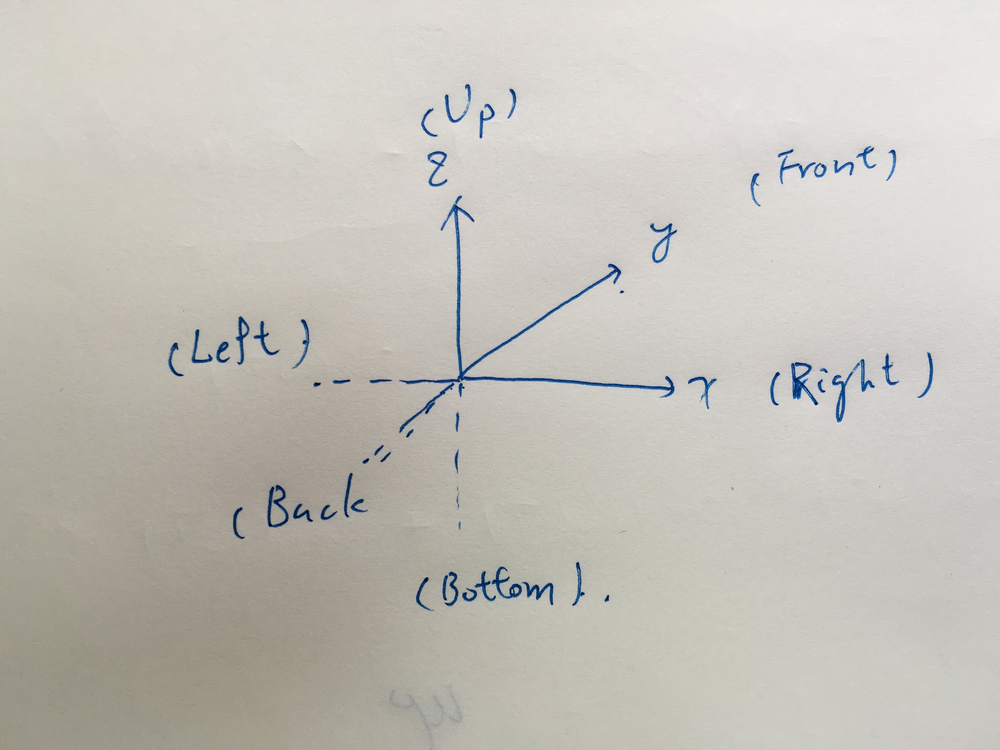
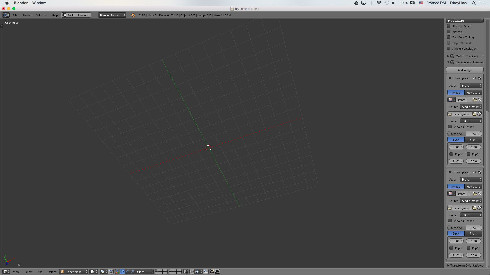

# Notes for Blender

- author: dboyliao `<qmalliao@gmail.com>`

## Basic Navigation

- Touch Pad:
    - Relocate cursor: one finger tap.
    - Rotation: two fingers sliding.
    - Move Object: It consists of two phrases
        1. Temporary moving objects: two fingers press.
        2. Confirm: one finger press.
        3. Reset to original position: two fingers tap.
    - Zooming: Two finger pinch

- Mouse:
    - Relocate cursor: left click
    - Rotation: Press and hold scroll wheel and move the mouse.
    - Move Object: 
        1. Temporary moving objects: hold on right click and move.
        2. Confirm: left click
        3. Reset: right click 
    - Zooming: scroll wheel.

- View:
    - `5`: Switch between `User Perspective Mode` and `Othographic Mode`.  
    - `1`: Front
    - `Ctr + 1`: Back
    - `3`: Right
    - `Ctr + 3`: Left
    - `7`: Top
    - `9`: Botton
    - 2, 4, 6, 8: Rotation to up, left, right, down.
    - `Ctr + 2, 4, 6, 8`: Translate entire view up, left, right, down.

- Pannel Layouts:
    - Ctr + `←` or `→`: Switch pannel layout
    - Ctr + `↑` or `↓`: Switch to `3D View` mode or switch back.

- Control Pannels:
    - `n`: properties
    - `t`: transforms and other related tools. 

- Coordinate System:
    - Overview:
        + 
    - Front:
        + 
    - Back:
        + 
    - Right:
        + 
    - Left:
        + 
    - Top
        + 
    - Bottom:
        + 

- Search: `<space>` 

- Switching Modes:
    + `<tab>`: Edit Mode
    + `Ctr + <tab>`: Select Mesh select mode

- Short Cuts:
    + `Ctr + r`: loop cut.
    + `g`: Grap mode
    + `s`: Scale mode

## Settings

- User Preferences
    - Enable Keyboard as Numpad
        - Go to `User Preference >> Input` and click `Emulate Numpad` on the left.
        - Click `Save User Settings`

## The `boy` Module

## `app` Submodule

## `context` Submodule

## `data` Submodule

## `ops` Submodule

## `path` Submodule

## `props` Submodule

## `types` Submodule

## `utils` Submodule

# References

- [Blender Character Modeling](https://www.youtube.com/watch?v=0QT1GNMevfc)
- [BVHTree](https://en.wikipedia.org/wiki/Bounding_volume_hierarchy)
- [bpy Module](http://www.blender.org/api/blender_python_api_2_76_1/)
- [Hot Keys](http://wiki.blender.org/index.php/Doc:2.4/Reference/Hotkeys/All)
- [Select Multiple Edges](http://wiki.blender.org/index.php/Doc:2.4/Manual/Modeling/Meshes/Selecting/Edges)